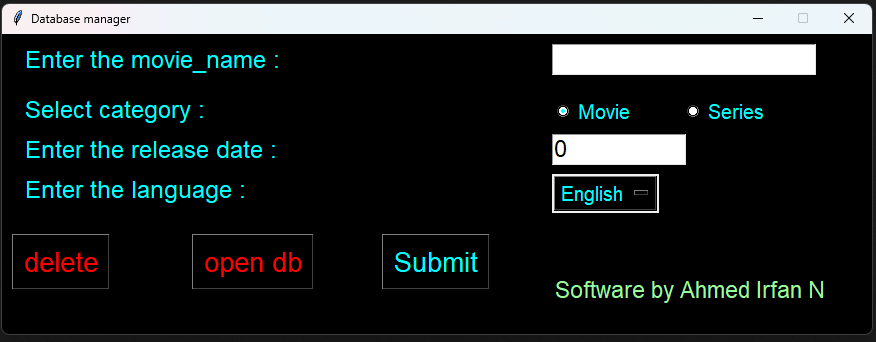
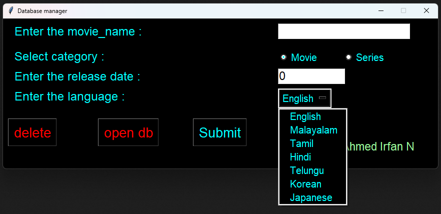
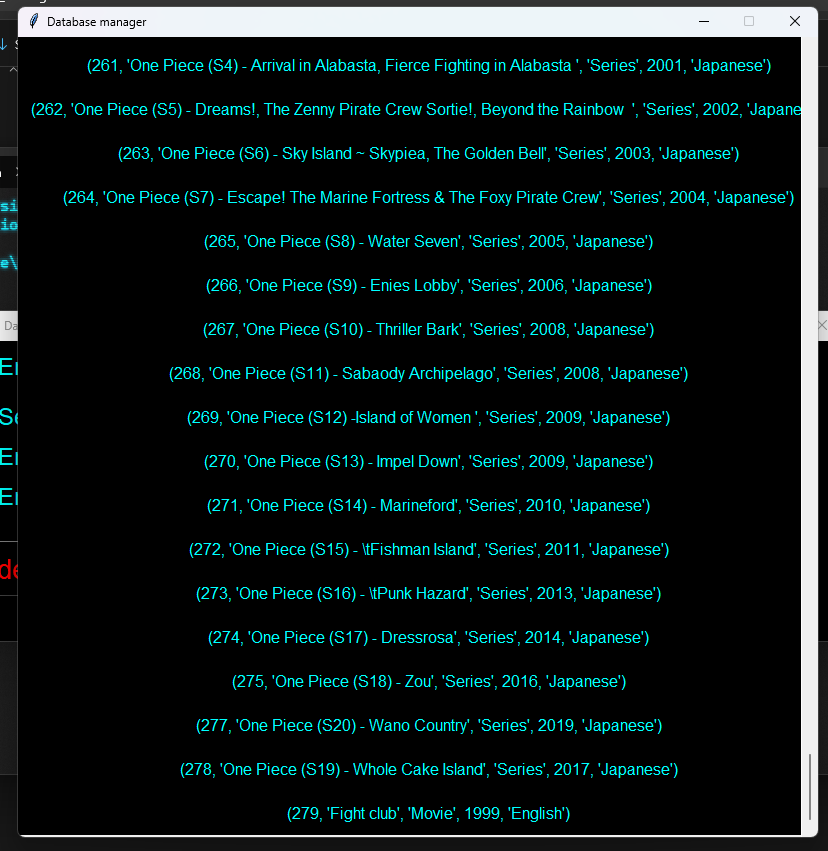
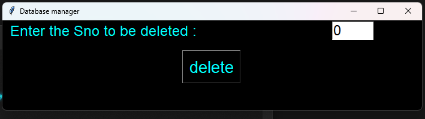

# 🎬 Movie Database Manager

## 📌 Overview
Movie Database Manager is a **GUI-based application** built with **Python and Tkinter** to manage your personal movie and series collection efficiently. With a sleek interface and MySQL integration, this tool allows users to:
✅ Add movies and series with details like name, category, release year, and language.
✅ View the entire database in a scrollable format.
✅ Delete unwanted records using a serial number.
✅ Automatically export the database to a CSV file upon closing.

---

## 🌟 Features
🎥 **Add Movies/Series** – Input and store records in the database effortlessly.
📜 **View Database** – Retrieve and display stored records in a user-friendly GUI.
🗑 **Delete Entries** – Remove records quickly using their serial number.
💾 **Export to CSV** – Automatically backs up data upon exit.

---

## 📷 Screenshots
## Screenshots 📸

### Main UI


### Drop down UI


### Movie Database


### Delete UI


---

## ⚙️ Requirements
### **Software Dependencies**
Ensure you have the following installed before running the application:
- **Python 3.x**
- **MySQL Server**
- **Required Python Libraries**:
  ```sh
  pip install mysql-connector-python
  ```

---

## 🚀 Setup & Installation
### **1️⃣ Set up MySQL Database**
- Create a MySQL database named **`movies_series`**.
- Create a table named **`movies_seen`** using the following SQL command:
  ```sql
  CREATE TABLE movies_seen (
      Sno INT PRIMARY KEY AUTO_INCREMENT,
      movie_name VARCHAR(255),
      category VARCHAR(50),
      release_year INT,
      language VARCHAR(50)
  );
  ```

### **2️⃣ Configure Database Connection**
- Open `manager_gui.py` and update the MySQL credentials:
  ```python
  sql.connect(host='localhost', user='your_username', password='your_password', database='movies_series')
  ```

### **3️⃣ Run the Application**
  ```sh
  python manager_gui.py
  ```

---

## 🎮 How to Use
1️⃣ **Adding Entries**
   - Fill in the movie/series details in the input fields.
   - Click **Submit** to save the entry to the database.

2️⃣ **Viewing Entries**
   - Click **Open DB** to display all stored records.

3️⃣ **Deleting Entries**
   - Click **Delete**, enter the serial number, and confirm deletion.

4️⃣ **Closing Application**
   - Your data is automatically exported to `movies_seen.csv`.

---

## 👤 Author
Developed by **Ahmed Irfan N**.

---

## 📜 License
This project is **open-source** and available for educational purposes.

Feel free to contribute or improve this project! 🚀

